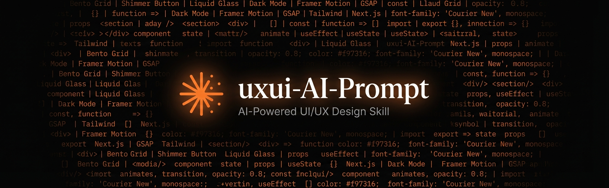

<div align="center">



# uxui-AI-Prompt

**The AI skill that builds premium SaaS interfaces — so you don't have to.**

Dark-mode first · Animation-driven · Gemini-powered visuals

<br />

[](https://github.com/GlamgarOnDiscord/uxui-AI-Prompt/stargazers)
[](./LICENSE)

[](https://docs.anthropic.com/en/docs/claude-code)
[](https://ai.google.dev/gemini-api/docs/image-generation)
[](https://tailwindcss.com)
[](https://nextjs.org)
[](https://agentskills.io/)

<br />

[Get Started](#-quick-start) · [Features](#-what-it-does) · [Install](#-install-anywhere) · [Contributing](#-contributing)

</div>

<br />

---

<br />

## ⚡ What is this?

A **plug-and-play AI skill** that turns any coding agent into a senior frontend engineer with the eye of a creative director.

Drop it into Claude Code, Cursor, VS Code Copilot, or any compatible tool — and start building interfaces inspired by **Vercel, Linear, Stripe, and Raycast** in seconds.

> **Skill mode** (`uxui-designer/`) — modular, lazy-loaded, optimized for Claude Code & compatible agents.
> **Prompt mode** (`prompt.md`) — single-file system prompt for ChatGPT, Windsurf, Aider, or anything else.

<br />

## 🎯 What it does

<table>
<tr>
<td width="50%">

### 🎨 Design System
- Zinc/Slate dark-mode palette — never pure black
- Geist, Satoshi, Cabinet Grotesk typography
- Shimmer Buttons, Bento Grids, Liquid Glass Cards
- WCAG AAA contrast (7:1 normal, 4.5:1 large)
- Strict anti-patterns enforced automatically

</td>
<td width="50%">

### 🎛️ 3 Design Dials
```
DESIGN_VARIANCE  = 8   (symmetry → chaos)
MOTION_INTENSITY = 6   (static → cinematic)
VISUAL_DENSITY   = 4   (gallery → cockpit)
```
Change a dial in chat → the entire output adapts.

</td>
</tr>
<tr>
<td>

### 🎬 6 Motion Patterns
| | |
|-|-|
| Ghost Cursor | SVG cursor clicks real UI |
| Type-Delete-Retype | Code rewrites itself |
| Algorithm Viz | Data structure animates |
| Live Editor | Code → preview morphs live |
| Auto Dashboard | KPIs cycle with spring physics |
| Morphing Metric | Stats scramble & cross-fade |

</td>
<td>

### 🖼️ Gemini Image Generation
Runs automatically at the end of every build:
1. Audits all image zones in the page
2. Crafts cinematic prompts per zone
3. Generates via REST API or Python SDK
4. Integrates with overlays & `alt` attrs
5. Falls back gracefully if no API key

**Models:** `gemini-3.1-flash-image-preview` (default) · `gemini-3-pro-image-preview` (complex scenes)

</td>
</tr>
</table>

<br />

## 📁 Architecture

```
uxui-AI-Prompt/
│
├── prompt.md                      ← Standalone prompt (any AI tool)
│
└── uxui-designer/                 ← Skill (Claude Code & compatible agents)
    ├── SKILL.md                   ← Entry point — loads references on demand
    └── references/
        ├── design-system.md       ← Colors · Typography · Layout · Components
        ├── motion-patterns.md     ← Framer Motion · GSAP · 6 autonomous demos
        ├── copywriting.md         ← Copy rules · CTAs · Anti-patterns
        ├── page-structure.md      ← 8 mandatory sections with specs
        └── image-generator.md     ← Gemini API pipeline (REST + SDK)
```

```
 User prompt → SKILL.md → lazy-load references → build page → image-generator → done
```

<br />

## 🚀 Quick Start

**Claude Code — one command:**

```bash
git clone https://github.com/GlamgarOnDiscord/uxui-AI-Prompt.git
cp -r uxui-AI-Prompt/uxui-designer ~/.claude/skills/uxui-designer
```

Then just ask Claude to build any UI:

```
Build a landing page for a developer analytics SaaS.
Next.js + Tailwind. Dark mode. Emphasize the real-time dashboard.
```

The skill handles everything: onboarding questions → design dials → layout → animations → Gemini visuals.

<details>
<summary><strong>Optional — Enable Gemini image generation</strong></summary>

Get a free API key at [aistudio.google.com/apikey](https://aistudio.google.com/apikey), then:

```bash
export GEMINI_API_KEY="your-key-here"     # Linux / macOS
$env:GEMINI_API_KEY = "your-key-here"     # PowerShell
```

**Zero dependencies (REST API)** — works with just `curl`. No Python needed.
**Or with Python SDK** — `pip install google-genai Pillow` for batch generation.

</details>

<br />

## 🔌 Install Anywhere

<details>
<summary><strong>Claude Code</strong></summary>

| Scope | Command |
|-------|---------|
| Personal (all projects) | `cp -r uxui-designer ~/.claude/skills/uxui-designer` |
| Project (team-shared) | `mkdir -p .claude/skills && cp -r uxui-designer .claude/skills/uxui-designer` |
| Session (temporary) | `claude --add-dir /path/to/uxui-designer` |

</details>

<details>
<summary><strong>Cursor · VS Code Copilot · Amp · Junie · Goose</strong></summary>

Copy the `uxui-designer/` folder into your tool's skill directory:

| Tool | Path |
|------|------|
| Cursor | `.cursor/skills/uxui-designer/` |
| VS Code Copilot | `.github/skills/uxui-designer/` |
| Amp | `.amp/skills/uxui-designer/` |
| Junie (JetBrains) | `.junie/skills/uxui-designer/` |
| Goose | `.goose/skills/uxui-designer/` |

> Follows the open [Agent Skills](https://agentskills.io/) standard — any compatible tool auto-discovers `SKILL.md`.

</details>

<details>
<summary><strong>Windsurf · Aider · ChatGPT · Others</strong></summary>

These tools don't support skills — use the standalone prompt instead:

| Tool | How |
|------|-----|
| Windsurf | Paste `prompt.md` contents into `.windsurfrules` |
| Aider | `aider --read prompt.md` |
| ChatGPT / Other | Paste `prompt.md` as system prompt |

</details>

<br />

## 📦 Tech Stack

| | |
|-|-|
| **Framework** | React · Next.js App Router (preferred) · Static HTML |
| **Styling** | Tailwind CSS |
| **Animation** | Framer Motion · GSAP / ScrollTrigger · Tailwind Animate |
| **Icons** | Phosphor Icons (preferred) · Lucide · HugeIcons |
| **Components** | Magic UI · Aceternity UI · ShadCN · Reactbits |
| **Images** | Gemini `gemini-3.1-flash-image-preview` / `gemini-3-pro-image-preview` |

<br />

## 🤝 Contributing

PRs, ideas, and issues welcome. You can improve the design system, add motion patterns, or refine the Gemini prompting logic.

```bash
fork → git checkout -b my-feature → PR
```

<br />

## 📜 License

Open License — use, modify, and share freely with credit to [GlamgarOnDiscord/uxui-AI-Prompt](https://github.com/GlamgarOnDiscord/uxui-AI-Prompt).

---

<div align="center">
<sub>Build interfaces that feel alive — with the precision of a senior engineer and the eye of a creative director.</sub>
</div>
